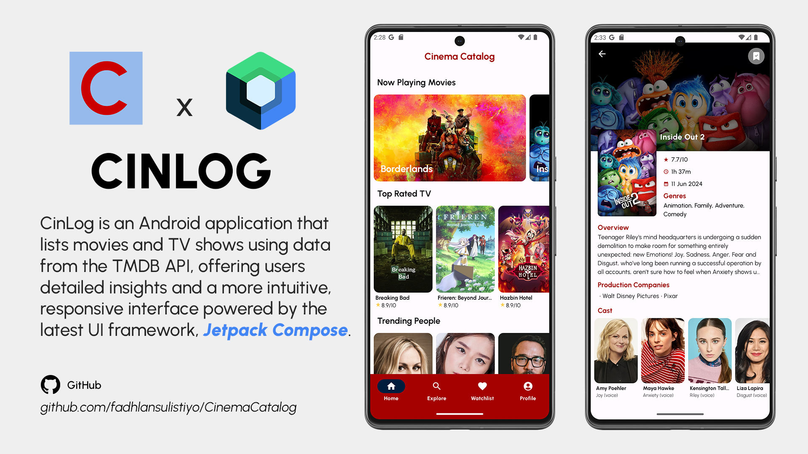
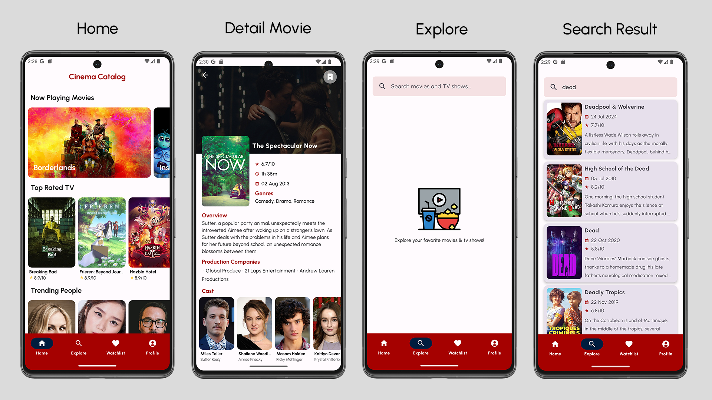
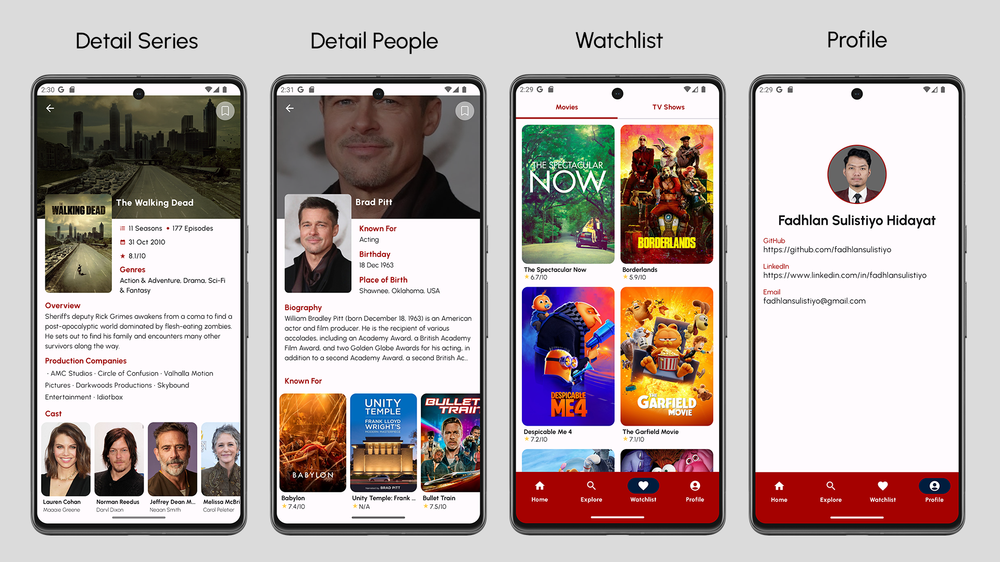

# Cinema Catalog (CinLog)

Cinema Catalog (CinLog) is an Android application that presents a comprehensive collection of movies and TV shows, with data sourced from the TMDB API. Users can effortlessly browse popular titles, explore detailed information, and discover new content. Transitioning from [Cinema Database](https://github.com/fadhlansulistiyo/CinemaDatabase), the app now features a modern interface built with Jetpack Compose, offering a smoother, more engaging user experience.

## Features
- Browse Movies & TV Shows: Explore a vast collection of Now Playing movies & airing today TV shows.
- Detailed Information: View comprehensive details about each title, including synopsis, release date, ratings, and more.
- Trending & Popular People: Discover trending and popular actors, directors, and other celebrities, with detailed profiles for each.
- Search Functionality: Quickly find specific movies, TV shows.
- Responsive UI: Enjoy a smooth and intuitive user interface.
- Watchlist: Add movies and TV shows to your watchlist for easy access later.

## Prerequisites

- Android Studio
- TMDB Api Key (If you have your own)

### Setup Requirement 

1. **Clone the repository**:
    ```bash
    git clone https://github.com/fadhlansulistiyo/CinemaCatalog.git
    ```

2. **Add your TMDB Api Key**:
    - Obtain your API key from the [TMDB Api](https://developer.themoviedb.org).
    - Add the following line to your `build.gradle.kts (Module:app)`
      ```
      buildConfigField("String", "API_KEY", "\"your api key here\"")
      ```

3. **Build and Run the project**

## Tech Stack

- **Jetpack Compose**: Modern UI toolkit used for building native Android interfaces declaratively.
- **Clean Architecture**: Organized into Data, Domain, and Presentation layers for modularity and separation of concerns.
- **Kotlin**: Primary programming language used for developing the application.
- **Coroutines**: Manages asynchronous programming.
- **Data Stream (Coroutines Flow)**: Streams asynchronous data.
- **Hilt**: Dependency Injection framework for managing app components.
- **Retrofit**: Type-safe HTTP client for API communication.
- **Room**: Local database solution for managing app data.
- **Jetpack Navigation Compose**: Manages in-app navigation, including Bottom Navigation.
- **Paging**: Handles efficient data pagination for lists.

## Screenshots (Light Theme)




## Acknowledgments

This project was developed as part of the submission project for the [Dicoding](https://www.dicoding.com/academies/445) class - Belajar Membuat Aplikasi Android dengan Jetpack Compose. Special thanks to Dicoding for providing comprehensive learning resources and guidance throughout the course.
